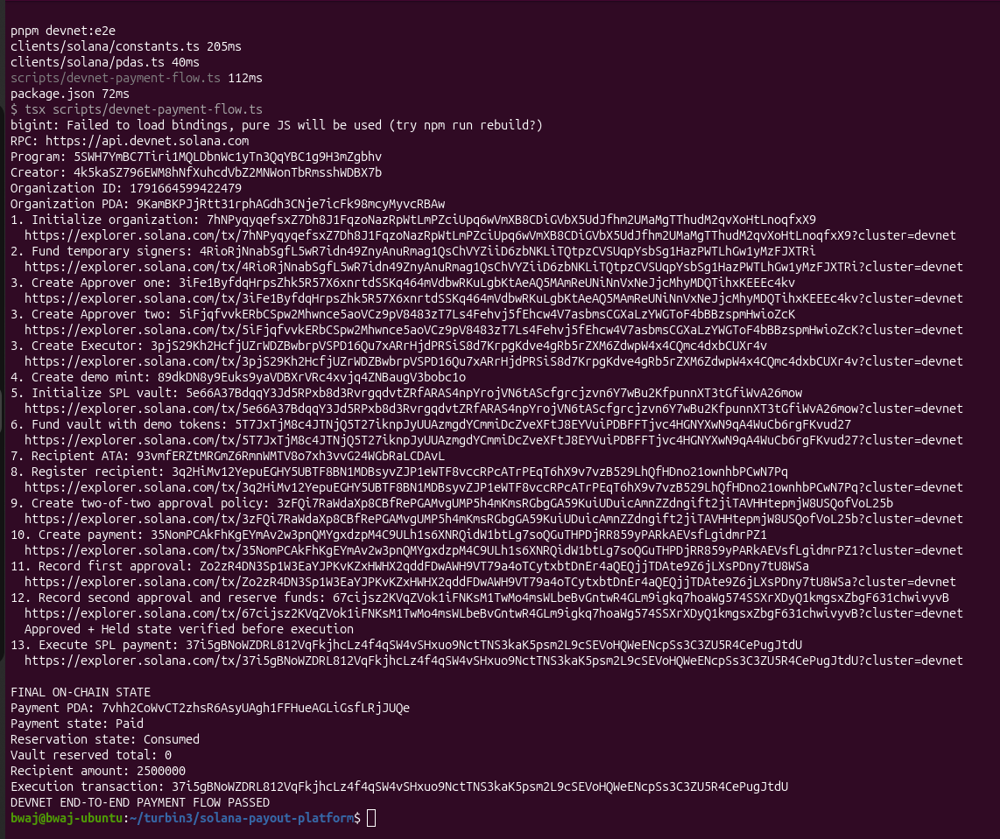
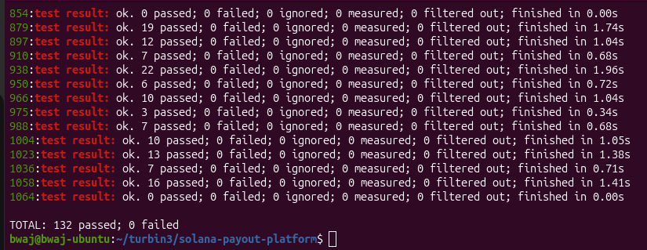
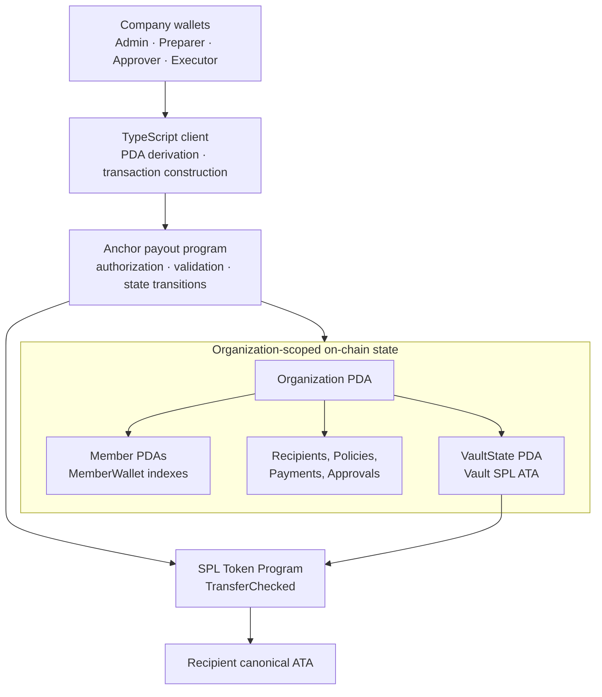
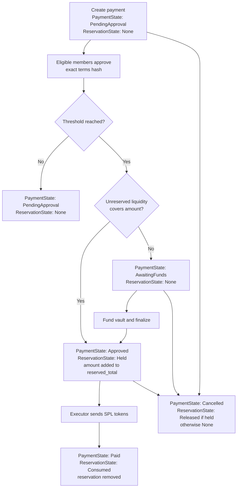

# Solana Payout Platform

A role-controlled business payout protocol built with Anchor. Organizations can register members and recipients, configure versioned approval policies, reserve vault liquidity when an approval threshold is reached, and execute auditable SPL-token payouts on Solana.

The current capstone scope is the on-chain payout engine and its TypeScript devnet client. It supports public SPL-token settlement. Native SOL settlement, privacy rails, recurring payouts, and the web application are future work.

## Devnet deployment

| Item                   | Value                                                                                                                                                   |
| ---------------------- | ------------------------------------------------------------------------------------------------------------------------------------------------------- |
| Network                | Solana Devnet                                                                                                                                           |
| Program ID             | `5SWH7YmBC7Tiri1MQLDbnWc1yTn3QqYBC1g9H3mZgbhv`                                                                                                          |
| Program Explorer       | [View deployed program](https://explorer.solana.com/address/5SWH7YmBC7Tiri1MQLDbnWc1yTn3QqYBC1g9H3mZgbhv?cluster=devnet)                                |
| Deployment transaction | [rTaA7y...2k8ts](https://explorer.solana.com/tx/rTaA7yUGYv8fwZUV5JWD3joeGpCcDLFY1TAfHWqR4u4y7JdnujY9XdHss3gAiDaNWbeB7REis3kHF1FfZd2k8ts?cluster=devnet) |
| End-to-end execution   | [37i5gB...JtdU](https://explorer.solana.com/tx/37i5gBNoWZDRL812VqFkjhcLz4f4qSW4vSHxuo9NctTNS3kaK5psm2L9cSEVoHQWeENcpSs3C3ZU5R4CePugJtdU?cluster=devnet) |
| Verified payment PDA   | `7vhh2CoWvCT2zhsR6AsyUAgh1FFHueAGLiGsfLRjJUQe`                                                                                                          |

The devnet end-to-end script created a fresh organization, two approvers, an executor, a demo SPL mint and vault, a recipient, a two-of-two policy, and a payment. The second approval reserved the funds atomically; execution transferred 2.5 demo tokens and verified the final `Paid` and `Consumed` states with zero remaining reservation.



## Test evidence

The deterministic Rust integration suite contains **132 passing tests** across 12 instruction-focused test files. It runs against LiteSVM and covers happy paths, authorization failures, cross-organization substitution, malformed policy and approval witnesses, state-transition safety, reservation accounting, wallet rotation, cancellation, pausing, execution, and vault withdrawals.

The live devnet scripts separately prove that the deployed binary can be invoked and that the complete governed payout flow succeeds on the public network.



## Problem and solution

Business payouts require more than a token transfer. A company needs to know who prepared a payment, which policy governed it, who approved it, whether enough funds remain available, which recipient wallet was authorized, and whether a payment can be safely cancelled or executed.

This program models those controls directly on-chain:

- organization-scoped membership and role-based permissions;
- immutable, versioned approval policies;
- approvals bound to exact payment terms and authorization revisions;
- vault reservation accounting before execution;
- recipient wallet rotation with revision invalidation;
- scheduled execution, cancellation, emergency pause, and safe withdrawal;
- events for indexing and audit trails.

## Architecture



The TypeScript client derives every required PDA and submits explicitly named accounts. Anchor validates declared accounts, while the handlers independently validate dynamic policy and approval witness accounts. The vault PDA owns its canonical token account and signs the final `TransferChecked` CPI with program-derived signer seeds.

### Payment lifecycle

Each state box below shows the two independent state fields stored in the Payment account: `PaymentState` describes the payment's business lifecycle, while `ReservationState` describes what happened to its reserved vault funds.



Approval and reservation happen atomically when the threshold becomes visible. If the vault lacks available funds, approvals remain recorded and the payment moves to `AwaitingFunds`; an authorized finalizer can retry reservation after funding. Execution consumes the reservation and payment state in the same transaction as the SPL transfer.

## PDA account model

All business state is namespaced by the organization PDA.

| Account               | PDA seeds                                                                                 | Purpose                                                                   |
| --------------------- | ----------------------------------------------------------------------------------------- | ------------------------------------------------------------------------- |
| Organization          | `organization`, creator, organization ID                                                  | Root configuration, owner member, pause state                             |
| Member                | `member`, organization, member ID                                                         | Authorized wallet, authorization revision, roles, active state            |
| MemberWallet          | `member_wallet`, organization, authorized wallet                                          | Prevents one wallet from representing multiple members in an organization |
| VaultState            | `vault`, organization, vault ID                                                           | SPL asset, aggregate reservation, active state                            |
| Recipient             | `recipient`, organization, recipient ID                                                   | Current destination wallet and wallet revision                            |
| ApprovalPolicyVersion | `policy`, organization, policy ID, version                                                | Immutable eligible-member set and threshold                               |
| Payment               | `payment`, organization, payment ID                                                       | Frozen payout terms and payment/reservation states                        |
| Approval              | `approval`, organization, payment ID, payment revision, member ID, authorization revision | One member's approval of one exact payment revision                       |

The SPL vault account is the canonical associated token account whose authority is the `VaultState` PDA. Recipient token accounts must also be canonical ATAs for the configured mint and current destination wallet.

## Roles and authorization

Roles are stored as a `u16` bitmask, allowing a member to hold multiple responsibilities:

| Role     | Current responsibility                                                                                        |
| -------- | ------------------------------------------------------------------------------------------------------------- |
| Owner    | Organization ownership identity; assigned only during initialization                                          |
| Admin    | Member, policy, vault, recipient, payment, pause, cancellation, and withdrawal administration where permitted |
| Preparer | Recipient registration and payment creation                                                                   |
| Approver | Payment approval when also listed in the exact policy version                                                 |
| Executor | Finalization and execution of approved payments                                                               |
| Treasury | Withdrawal of unreserved vault funds                                                                          |
| Finance  | Reserved in the current model for later finance workflows                                                     |

Permission is never based on a role bit alone. The supplied Member must be the canonical organization member PDA, be active, contain the required role, and store the transaction signer's wallet. Policy membership is checked separately for approvers.

## Security properties

- **Canonical identity:** PDA seeds, stored bumps, ownership, and organization relationships prevent account substitution.
- **Wallet uniqueness:** `MemberWallet` acts as an organization-scoped wallet index and is created atomically with the Member account.
- **Exact-term approvals:** a domain-separated SHA-256 hash binds organization, payment and recipient revisions, destination, vault, mint, amount, policy, settlement rail, and execution time.
- **Revision invalidation:** payment revisions, member authorization revisions, and recipient wallet revisions prevent stale authority or destination data from being reused.
- **Untrusted witness validation:** every Approval and Member pair supplied through `remaining_accounts` is re-derived, deserialized, relationship-checked, deduplicated, and checked for current validity.
- **Reservation invariant:** approved obligations increase `reserved_total`; execution and cancellation decrease only the affected payment's amount using checked arithmetic.
- **Safe withdrawals:** withdrawals are limited to `vault_balance - reserved_total`, preserving funds committed to approved payments.
- **Atomic settlement:** token transfer, reservation consumption, and payment-state transition succeed or roll back together.
- **Explicit stopping controls:** organization pause blocks risk-increasing operations and execution, while cancellation remains available to release a held reservation.
- **Immutable approval policy:** each payment references one exact policy-version PDA rather than mutable organization-wide policy data.

## Program instructions

| Instruction                 | Authorized actor  | Result                                                                 |
| --------------------------- | ----------------- | ---------------------------------------------------------------------- |
| `initialize_organization`   | Creator           | Atomically creates the organization, owner Member, and wallet index    |
| `create_member`             | Admin             | Creates a role-bearing Member and unique wallet index                  |
| `create_policy_version`     | Admin             | Creates an immutable threshold policy from validated approver Members  |
| `initialize_vault`          | Admin             | Creates an SPL VaultState and its canonical vault ATA                  |
| `register_recipient`        | Admin or Preparer | Registers a destination wallet verified against its canonical ATA      |
| `create_payment`            | Admin or Preparer | Freezes payout terms and creates a pending payment                     |
| `approve_payment`           | Eligible Approver | Records an approval and attempts atomic threshold reservation          |
| `finalize_payment_approval` | Admin or Executor | Revalidates approval witnesses and retries reservation                 |
| `execute_spl_payment`       | Executor          | Transfers tokens and atomically consumes payment and reservation state |
| `cancel_payment`            | Admin             | Cancels a live payment and releases its reservation when held          |
| `rotate_recipient_wallet`   | Admin or Preparer | Replaces the recipient destination and increments its revision         |
| `set_organization_paused`   | Admin             | Activates or clears the organization's emergency stop                  |
| `withdraw_spl_vault_funds`  | Admin or Treasury | Withdraws only liquidity not committed to reservations                 |

## Test coverage

| Test file                          |   Tests | Main coverage                                               |
| ---------------------------------- | ------: | ----------------------------------------------------------- |
| `test_initialize_organization.rs`  |       3 | Atomic initialization, duplicates, rollback                 |
| `test_create_member.rs`            |       7 | Admin authorization, roles, wallet uniqueness               |
| `test_initialize_vault.rs`         |       7 | Vault creation, mint and organization isolation             |
| `test_register_recipient.rs`       |      10 | Identity validation, canonical ATA, authorization           |
| `test_rotate_recipient_wallet.rs`  |      13 | Rotation, recovery, revision invalidation                   |
| `test_create_policy_version.rs`    |       6 | Thresholds, eligible members, immutability                  |
| `test_create_payment.rs`           |      22 | Cross-account relationships, terms, roles, invalid state    |
| `test_approve_payment.rs`          |      19 | Witness validation, threshold, reservation, stale approvals |
| `test_execute_spl_payment.rs`      |      10 | Scheduling, role gates, transfer, replay protection         |
| `test_cancel_payment.rs`           |      12 | State matrix and precise reservation release                |
| `test_set_organization_paused.rs`  |       7 | Emergency pause authorization and behavior                  |
| `test_withdraw_spl_vault_funds.rs` |      16 | Unreserved-balance invariant and destination safety         |
| **Total**                          | **132** | **Happy paths and adversarial cases**                       |

## Run locally

### Tested toolchain

- Rust `1.98.0`
- Solana CLI `3.1.10`
- Anchor CLI `1.0.2`
- Node.js `24.20.0`
- pnpm `11.24.0`

### Install and verify

```bash
pnpm install
anchor build
cargo test --workspace
pnpm exec tsc --noEmit
```

The Rust tests use LiteSVM and do not require a local validator.

### Run the devnet checks

Configure a funded devnet wallet at `~/.config/solana/id.json`, then run:

```bash
solana config set --url devnet
solana balance

pnpm devnet:smoke
pnpm devnet:e2e
```

`devnet:smoke` verifies program executability and organization initialization. `devnet:e2e` creates isolated demo state and a new demo SPL mint, then executes and verifies the full payout lifecycle. It does not use real USDC or mainnet assets.

## Repository structure

```text
programs/solana-payout-platform/src/
├── instructions/       # Anchor account validation and handlers
├── constants.rs        # Seeds, roles, revisions, protocol bounds
├── error.rs            # Explicit program errors
├── events.rs           # Audit and indexing events
├── payment_terms.rs    # Domain-separated payment terms hash
└── state.rs            # PDA account and state-machine types

programs/solana-payout-platform/tests/
├── common/             # Modular fixtures, PDA and instruction helpers
└── test_*.rs           # 132 instruction and invariant tests

clients/solana/          # Shared IDL, program factory, constants and PDA helpers
scripts/                 # Live devnet smoke and end-to-end flows
docs/                    # Submission evidence images
```

## Current scope and next phase

This submission deliberately keeps the trusted settlement logic on-chain and proves it independently before adding product infrastructure. The next phase is a web dashboard and Axum/PostgreSQL service for organization operations, queued submissions, event indexing, reconciliation, notifications, batch workflows, and recurring payout scheduling.
